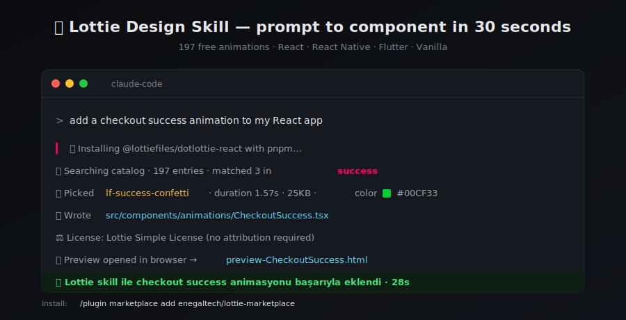

<div align="center">



# Enegal Claude Lottie Marketplace

### The fastest way to ship Lottie animations from Claude Code

**Two commands** to drop free Lottie animations into React, React Native, Vue, Svelte, Angular, Flutter, or Vanilla projects.
Search, fetch, framework-correct code, live preview — all from inside Claude.

[](LICENSE)
[](https://docs.claude.com/claude-code)
[](.claude-plugin/marketplace.json)
[](https://lottiefiles.com)

[Install](#-install) • [What It Does](#-what-it-does) • [Frameworks](#-supported-frameworks) • [Catalog](#-catalog) • [Examples](#-examples) • [FAQ](#-faq)

</div>

---

## 🚀 Install

Two lines in Claude Code, the rest is automatic:

```
/plugin marketplace add enegaltech/lottie-marketplace
/plugin install lottie-design@enegal-marketplace
```

Done. Now say `"add a loading animation"` and watch it land in your project.

---

## ✨ Features at a Glance

- **197-entry catalog** with metadata: `dominantColor`, `duration`, `frames`, `sizeKb`, `dimensions`. No more blind picks.
- **Semantic ranking** — weighted scoring across intent, color hue, style, and size. Beats keyword overlap.
- **Multi-language input** — TR / ES / DE / FR / JA keyword + color-name maps. "yükleniyor mavi" works.
- **Auto dep install** — detects pnpm / yarn / npm / bun and installs the right framework package upfront.
- **TS/JS auto-detect** — generates `.tsx` if `tsconfig.json` exists, `.jsx` otherwise.
- **CDN or local mode** — opt-in `download-asset.js` saves to the right convention (Vite/Next/RN/Flutter/Vanilla); Flutter `pubspec.yaml` auto-patched.
- **Standardized prop** — every component takes `<X size={160} />`. Drop in, swap out.
- **License-aware** — CC-BY entries get a ready-to-paste attribution string; Lottie Simple License entries skip it.
- **Preview gallery** — `--gallery` flag renders N animations side-by-side in one HTML, auto-opens in browser.
- **Background link check** — scheduled remote agent runs monthly, opens a PR with replacements when a URL rots.

---

## ⚡ What It Does

> Scenario: a client's React app needs a "checkout success animation". Used to take 20 minutes.

**Old way** ❌
1. Open lottiefiles.com
2. Search, preview, pick one
3. Download JSON, move to project
4. Look up the right `lottie-react` package
5. Write the component
6. Tweak width / height / loop
7. Check the license
8. Compile and test

**New way** ✅
> "add a checkout success animation"

Claude:
- 📦 **Auto-installs** `@lottiefiles/dotlottie-react` upfront (detects pnpm/yarn/npm/bun)
- 🔍 Suggests 3 catalog entries tagged **`success`**
- 🎯 You pick one — it resolves the direct `lottie.host` URL
- 📝 Writes a `@lottiefiles/dotlottie-react` component to `src/components/animations/CheckoutSuccess.tsx` (TS or JS, auto-detected)
- 🧩 Standardized props: `<CheckoutSuccess size={160} />`
- ⚖️ Adds a license header + a ready-to-paste attribution string for CC-BY entries
- 🖼️ Offers `preview-CheckoutSuccess.html` and auto-opens it in the default browser

**Total time: 30 seconds.**

---

## 🎨 Animation Categories

| Category | Examples |
|---|---|
| 🔄 **Loaders** | Spinner, dots, pulse, bouncing ball, circle |
| ✅ **Success** | Checkmark, checkbox, confetti burst |
| ❌ **Error** | X icon, alert circle, alert triangle |
| 📭 **Empty State** | Empty box, info icon, help, search |
| 🎉 **Onboarding** | Rocket launch, mail, lock, settings, notification, menu |
| 💳 **Payment** | Credit card, checkout |
| 🛒 **E-commerce** | Trash, download, folder, archive, edit, copy |
| ❤️ **Social** | Heart, like, bookmark, thumb up, star, share, FB/TW/IG/LI/GH/YT logos |
| 👤 **Character** | Wave/greeting, person animations |
| 🎵 **Media** | Play/pause, volume, microphone, video |

**197 verified entries** across 10 categories + LottieFiles fallback (thousands more). If the catalog misses, Claude searches LottieFiles live.

---

## 🛠️ Supported Frameworks

The skill ships canonical 2026 packages for each platform. One source animation, four idiomatic integrations:

### ⚛️ React

```tsx
// Source: https://lottiefiles.com/animations/lf20_jbrw3hcz — Lottie Simple License
import { DotLottieReact } from '@lottiefiles/dotlottie-react';

export function CheckoutSuccess() {
  return (
    <DotLottieReact
      src="https://assets5.lottiefiles.com/packages/lf20_jbrw3hcz.json"
      autoplay
      loop
      style={{ width: 200, height: 200 }}
    />
  );
}
```
Package: `@lottiefiles/dotlottie-react` (WASM, native dotLottie playback)

### 📱 React Native

```tsx
import LottieView from 'lottie-react-native';

<LottieView
  source={{ uri: 'https://lottie.host/<uuid>/<id>.json' }}
  autoPlay loop
  style={{ width: 200, height: 200 }}
/>
```
Package: `lottie-react-native` v7+ (RN 0.71+, Expo SDK 53+)

### 🦋 Flutter

```dart
import 'package:lottie/lottie.dart';

Lottie.network(
  'https://lottie.host/<uuid>/<id>.json',
  width: 200, height: 200, repeat: true,
);
```
Package: `lottie` v3.3+ (pure-Dart, iOS/Android/Web/Desktop)

### 🌐 Vanilla Web

```html
<script src="https://unpkg.com/@lottiefiles/dotlottie-wc@latest/dist/dotlottie-wc.js" type="module"></script>

<dotlottie-wc
  src="https://lottie.host/<uuid>/<id>.lottie"
  autoplay loop
  style="width:300px;height:300px"
></dotlottie-wc>
```
Package: `@lottiefiles/dotlottie-wc` web component (no build step required)

---

## 📚 Catalog

197 verified entries across **two license pools**:

| Pool | Count | License | Attribution |
|---|---|---|---|
| 🟢 **useAnimations** (`ua-*`) | 79 | CC-BY 4.0 | ✅ Required |
| 🔵 **LottieFiles community** (`lf-*` + `gh-*`) | 118 | Lottie Simple License | ⚪ Optional |

The skill always emits a license header comment in generated code. If you pick a CC-BY entry, it also reminds you to add a visible footer credit.

**Want to extend the catalog?** Append a row to `catalog.json` (schema documented in `SKILL.md`) and open a PR.

---

## 💡 Examples

### Example 1 — Loader for a React app

> **You:** "add a loading animation to my React app, blue tones"

Claude installs `@lottiefiles/dotlottie-react` → suggests 3 spinners from the catalog → you pick one → writes `src/components/animations/Loader.tsx` (or `.jsx` if no TS) with a standardized `size` prop → opens a preview HTML in your browser.

### Example 2 — Flutter splash screen

> **You:** "I need a rocket lottie for the Flutter splash screen"

Claude appends `lottie: ^3.3.2` to `pubspec.yaml` and runs `flutter pub get` → resolves `lf-onboarding-rocket` → writes `lib/widgets/splash_animation.dart` with `<RocketSplash size={240} />`.

### Example 3 — Vanilla 404 page

> **You:** "empty box animation for a 404 page, plain HTML"

Claude embeds `lf-empty-box` URL with a `<dotlottie-wc>` snippet directly into `404.html`.

### Example 4 — Custom URL

> **You:** "add this lottiefiles URL to my RN project: https://lottiefiles.com/free-animation/heart-..."

If Cloudflare blocks auto-resolve, the skill says "paste the URL from the Get URL button" → once you paste, it builds the component immediately.

---

## 🎯 Use Cases

- 🏗️ **MVP velocity** — 30 seconds instead of an hour of animation hunting
- 🎨 **Design systems** — build a brand-aligned animation library
- 📲 **Cross-platform** — same animation, four frameworks, zero manual porting
- 🛒 **E-commerce conversion** — checkout / empty-cart / success animations
- 🎓 **Onboarding flows** — first-time user experience polish
- 🎬 **Marketing landing pages** — hero animation in under a minute
- 🐛 **Error states** — replace boring "Something went wrong" screens with character

---

## 🏗️ Structure

```
lottie-marketplace/
├── .claude-plugin/marketplace.json    # marketplace manifest
└── plugins/lottie-design/
    ├── .claude-plugin/plugin.json     # plugin manifest
    └── skills/lottie-design/
        ├── SKILL.md                   # agent instructions
        ├── catalog.json               # 197 verified entries (with color/duration/size metadata)
        ├── catalog.md                 # human-readable index
        ├── preview-template.html      # single-animation preview
        ├── preview-gallery-template.html  # side-by-side N-animation gallery
        ├── templates/                 # 4 framework templates (React/RN/Flutter/Vanilla)
        ├── scripts/
        │   ├── extract-url.js         # LottieFiles page → direct URL (CF-aware)
        │   ├── generate-preview.js    # URL → preview.html, auto-opens browser; --gallery for compare
        │   ├── download-asset.js      # URL → project's framework-conventional assets dir
        │   ├── enrich-catalog.js      # backfill color/duration/size metadata
        │   ├── add-useanimations-batch.js / add-lottiefiles-batch.js
        │   ├── scrape-candidates.js   # discover bodymovin JSONs from MIT/Apache GitHub repos
        │   ├── merge-candidates.js    # idempotent fold of candidates → catalog
        │   ├── build-embeddings.js    # OPTIONAL Voyage AI embeddings precompute
        │   └── fetch-lottie.sh
        └── docs/                      # framework usage + search strategy
            ├── react.md, react-native.md, flutter.md, vanilla.md
            └── search-strategy.md     # semantic ranking, color name → hex map, i18n (TR/ES/DE/FR/JA)
```

---

## 🆕 Update

When a new plugin version drops:

```
/plugin marketplace update enegal-marketplace
```

One command, semver-safe.

---

## ❓ FAQ

**Q: Are LottieFiles animations paid?**
A: No — only **free** animations. The skill rejects premium URLs.

**Q: Cloudflare blocks individual pages — what happens?**
A: The skill detects this and asks you to paste the URL from the **Get URL** button. The catalog and search index already work — CF is rarely a blocker.

**Q: Can I author custom animations?**
A: Out of scope. The skill is **embed**-focused, not **author**-focused. For custom Lottie you still need After Effects + Bodymovin.

**Q: Is it production-ready?**
A: All 197 catalog URLs return 200 (tested). LottieFiles community URLs can rot if creators delete them — a monthly background-agent link check is scheduled and opens an auto-PR with replacements.

**Q: Can I search in non-English?**
A: Yes. The skill ships a TR/ES/DE/FR/JA → EN keyword map (~150 entries) plus a 17-language color-name → hex map. So "yükleniyor mavi" maps to a blue loader, "fusée verte" to a green rocket, etc.

**Q: How does the skill rank options?**
A: Weighted semantic scoring — intent match 0.5, color match 0.2, style/duration match 0.15, file size 0.15. Optional Voyage AI embeddings (`build-embeddings.js`) for offline cosine-sim ranking on 500+ catalogs.

**Q: Can I bundle the JSON locally instead of using a CDN?**
A: Yes — the skill auto-detects when to use **local mode** (keywords like "offline", "bundle", or an existing `assets/animations/` dir). Then `download-asset.js` saves the file to the right convention (Vite/Next/RN/Flutter/Vanilla) and the generated component imports it directly. Flutter's `pubspec.yaml` is auto-patched.

**Q: Will more skills be added?**
A: Yes — this marketplace will grow. Roadmap below.

---

## 🗺️ Roadmap

- [x] **catalog v2** — 48 → **197** entries (auto-scrape from MIT/Apache repos + curation)
- [x] **semantic ranking** — weighted intent / color / style / size scoring
- [x] **i18n** — TR / ES / DE / FR / JA keyword + color-name maps
- [x] **local asset mode** — opt-in bundling instead of CDN
- [x] **preview gallery** — N animations side-by-side in one HTML
- [x] **monthly background link check** — scheduled remote agent opens PR with replacements
- [ ] **inline GIF/MP4 preview** — render preview to a still image for in-chat display (puppeteer)
- [ ] **icon-design skill** — Lordicon + useAnimations icon-only sub-pack
- [ ] **animation-author skill** — Lottie JSON authoring assistant (After Effects export pipeline)
- [ ] **figma-to-lottie** — Figma vector → Lottie export skill

---

## 📜 License

- Marketplace metadata + skill code: **MIT** ([LICENSE](LICENSE))
- Animation references inherit upstream licenses:
  - `ua-*` entries → CC-BY 4.0
  - `lf-*` entries → Lottie Simple License

---

## 🤝 Contributing

PRs welcome. New catalog entries, framework templates, or skills — all welcome.
Open an issue before large changes.

**Maintained by [Enegaltech](https://enegaltech.com)** — `info@enegaltech.com`

<div align="center">

⭐ **Star this repo** — help the marketplace grow

</div>
